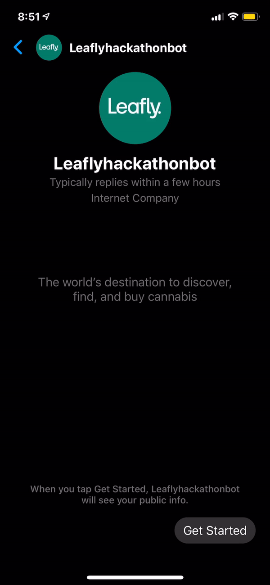
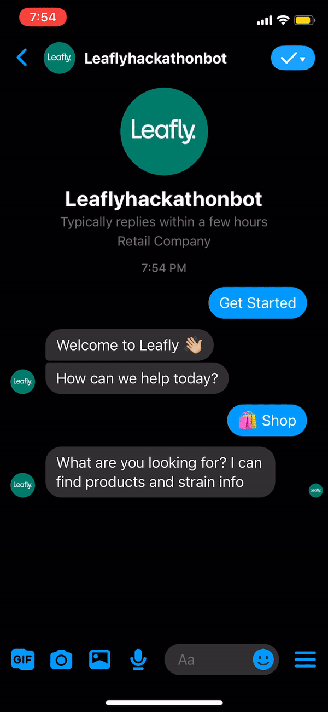

# leafly-bot

Leafly Messenger bot August 2020 company hackathon

[Here is the bot's Page](https://www.facebook.com/Leaflyhackathonbot-105918007903744)

## Demo 




## Development

```
Fill .env values
npm install
npm test
npm start
```

The Messenger platforms relies on a webhook. To use localhost as your webhook

- Install `ngrok` and initiate a local tunnel

```
./ngrok http 1337
```

Test your local tunnel is successful by testing the webhook

```
curl -X GET "https://0efd63c08e1c.ngrok.io/webhook?hub.verify_token=<YOUR_VERIFY_TOKEN>&hub.challenge=CHALLENGE_ACCEPTibe"ub.mode=subscribe"
```

And finally [update the Messenger app in Facebook settings](https://developers.facebook.com/apps/359612735032348/messenger/settings/) with the webhook path

#### Thanks to

Kelly
Cara
Dana
